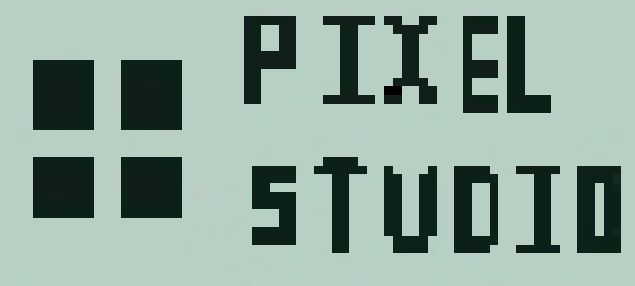
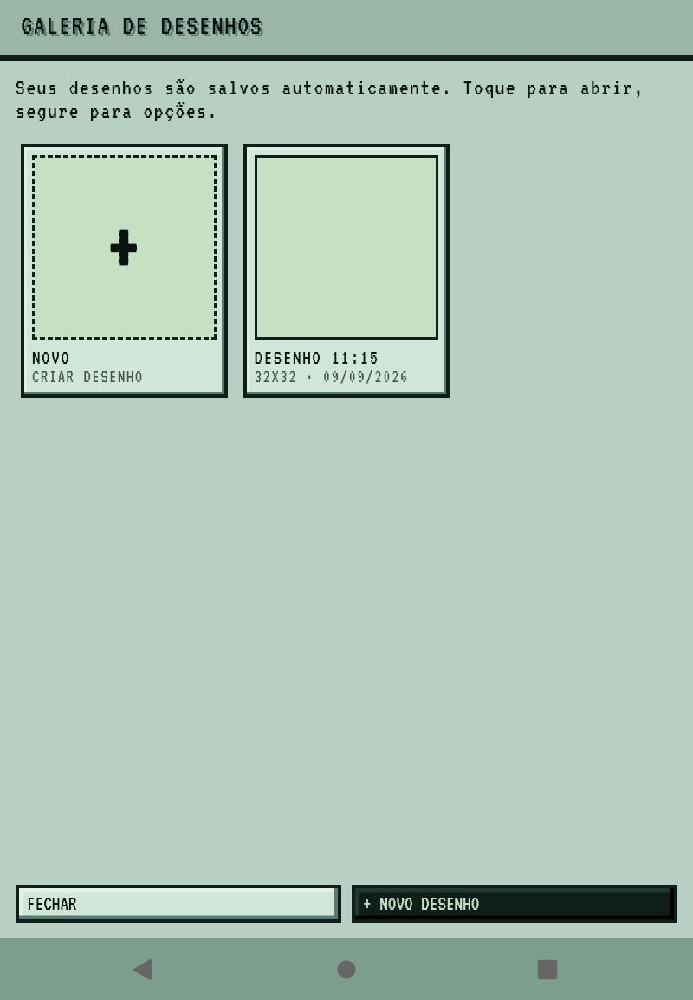
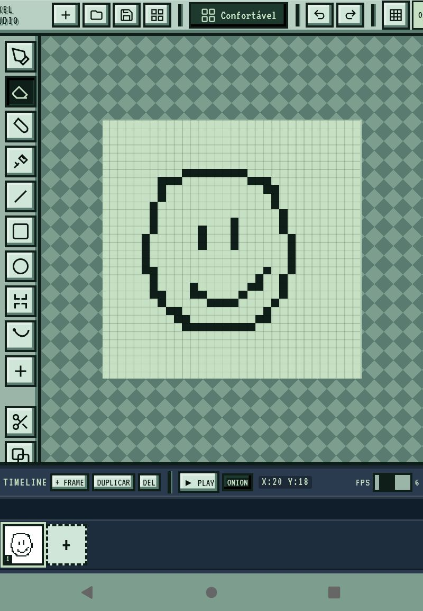
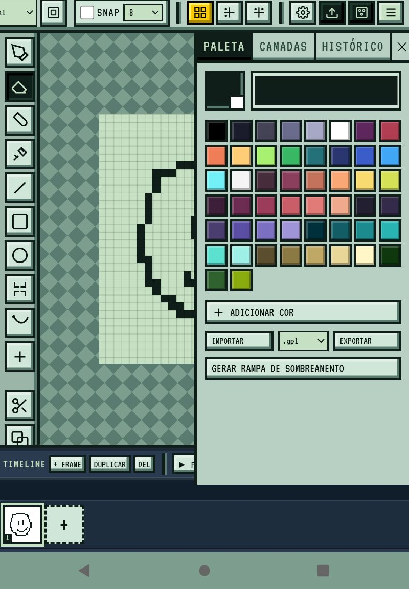
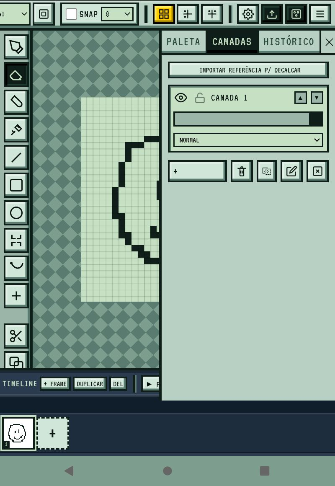
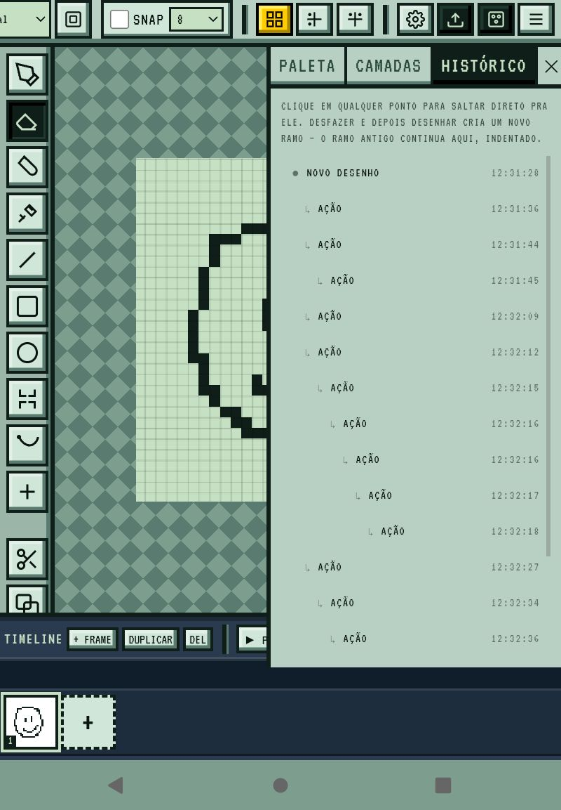
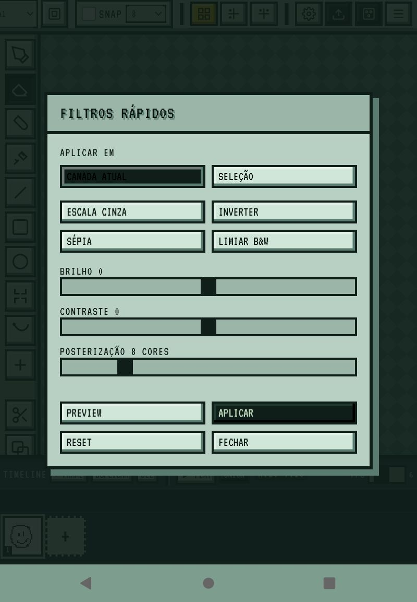
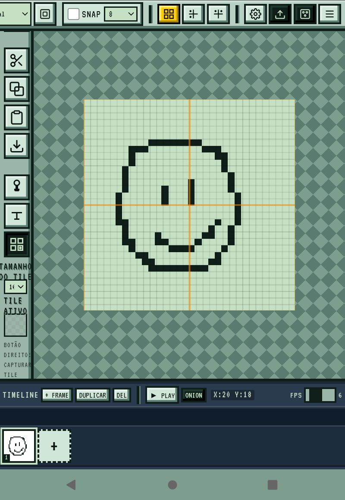
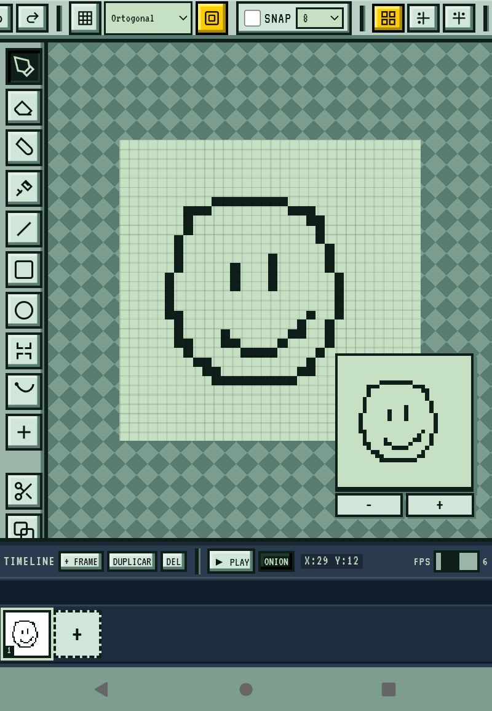

# Pixel-Studio

> Projeto em desenvolvimento ativo — versão estável funcional no navegador.

 Um editor de pixel art que roda direto no navegador, leve, com galeria e filtros e com um sistema de camadas, histórico ilimitado, galeria...

### Status
O que já funciona:
[x] Ferramentas: lápis, borracha...
[x] Sistema de camadas
[x] Histórico ilimitado
...

Roadmap: v1.1 → paletas | v1.2 → animação | v1.3 → release

Como usar
1. Abra o pixel-studio.html
2. Escolha o tamanho do canvas
3. Desenhe e salve na galeria

# Screenshot 

